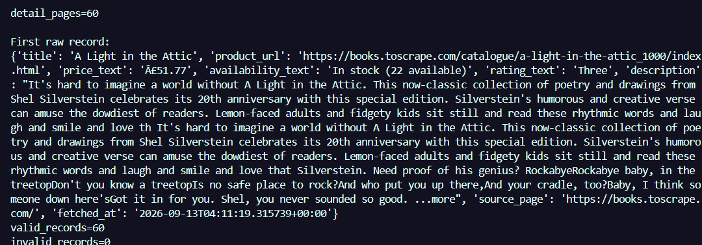
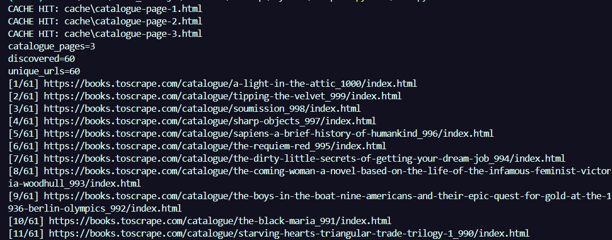
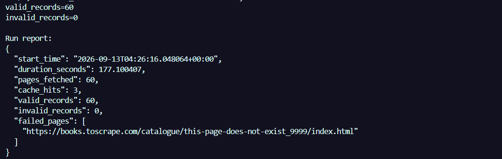
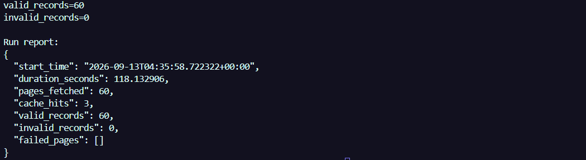

```bash
pip install -r requirements.txt
```

## Running the scraper

Run the scraper with:

```bash
python src/main.py
```

The scraper will:

1. Fetch or load the first 3 catalogue pages.
2. Discover and deduplicate the book URLs.
3. Visit the discovered book pages.
4. Extract the required book fields.
5. Normalize the price into `price_gbp`.
6. Validate the records using Pydantic.
7. Save valid records to `output/books.json`.
8. Save invalid records to `output/errors.json`.
9. Save run statistics to `output/run-report.json`.

### Catalogue discovery output

The scraper reaches the required checkpoint:

```text
catalogue_pages=3
discovered=60
unique_urls=60
```



## Caching

Catalogue pages are cached locally in the `cache/` directory.

On the first run, the scraper fetches the page:

```text
FETCH: https://books.toscrape.com/
```

On subsequent runs, the cached page is reused:

```text
CACHE HIT: cache/catalogue-page-1.html
```

This avoids repeatedly downloading the same catalogue pages.



The `cache/` directory is excluded from Git using `.gitignore`.

## Politeness rules

The scraper follows a deliberately small and polite request strategy.

### User-Agent

Requests use the following descriptive User-Agent:

```text
FlyRankInternship-A9/1.0 (+https://github.com/keerthana-s-10/polite_scraper)
```

### Timeout

Every HTTP request uses a finite timeout so that a stalled request does not block the entire scraper indefinitely.

### Request delay

Real requests are separated by at least 0.5 seconds.

### Status checking

Only HTTP `200` responses are accepted as successful page responses.

Other status codes are recorded as failed pages.

### Retry behaviour

A failed request is retried at most once when the failure is a timeout or a server-side `5xx` response.

Permanent client-side failures such as `403` and `404` are not repeatedly retried.

### Caching

Catalogue pages are cached locally and reused on subsequent runs.

## Validation and normalization

Book records are normalized before being written to the final output.

The price is converted from its original text representation into a numeric GBP value.

For example:

```text
£51.77
```

becomes:

```json
51.77
```

The original `price_text` is retained.

Pydantic is used to validate the final record schema.

The validated record contains:

```text
title
product_url
price_text
price_gbp
availability_text
rating_text
description
source_page
fetched_at
```

Product URLs and source URLs are required to use HTTPS.

Invalid records are stored in:

```text
output/errors.json
```

Valid records are stored in:

```text
output/books.json
```


## Output files

### `output/books.json`

Contains the validated and normalized book records.

A successful run produces:

```text
valid_records=60
```

The file contains 60 unique book records.

### `output/errors.json`

Contains records that failed normalization or Pydantic validation.

A successful run produces:

```text
invalid_records=0
```

### `output/run-report.json`

Contains information about the scraper run, including:

- start time
- duration
- pages fetched
- cache hits
- valid records
- invalid records
- failed pages

## Sample output

A successful run produced the following checkpoint:

```text
detail_pages=60
valid_records=60
invalid_records=0
```


A successful `run-report.json` contains results in this format:

```json
{
  "start_time": "2026-09-13T04:19:27.127448+00:00",
  "duration_seconds": 180.891176,
  "pages_fetched": 60,
  "cache_hits": 3,
  "valid_records": 60,
  "invalid_records": 0,
  "failed_pages": []
}
```


## Failure handling

Each book page is processed independently.

If one page fails, the scraper:

1. Records the failed URL.
2. Skips that page.
3. Continues processing the remaining pages.
4. Records the failure in `run-report.json`.

This means one broken page does not stop the entire run.

### Broken-page test

Failure handling was tested using a deliberately invalid book URL:

```text
https://books.toscrape.com/catalogue/this-page-does-not-exist_9999/index.html
```

The scraper completed the run and recorded the failed URL in the run report.

Example:

```json
{
  "failed_pages": [
    "https://books.toscrape.com/catalogue/this-page-does-not-exist_9999/index.html"
  ]
}
```



The fake URL was removed from the final scraper after testing.

## Why a browser was not needed

A browser automation tool was not necessary because the required catalogue and book information is available directly in the HTML returned by the website.

Requests is sufficient for downloading the pages, and Beautiful Soup is sufficient for parsing the required information.

No login flow, CAPTCHA, JavaScript interaction, or client-side rendering was required.

## Responsible scraping

This scraper is intentionally limited to a public practice website.

The implementation does not:

- bypass login requirements
- bypass paywalls
- bypass access controls
- evade blocking mechanisms
- scrape private information
- use aggressive concurrent requests
- repeatedly retry failed requests
- automatically target unrelated websites

If an API is available for another target, the API should be preferred where appropriate.

This project should not be reused on another website without first checking that site's rules, terms, robots guidance, and applicable policies.

## Limitation

The scraper depends on the availability and HTML structure of Books to Scrape.

If the website changes its HTML structure, the parser selectors may need to be updated.

Network failures can also prevent individual pages from being retrieved, although the scraper is designed to continue processing other pages when a page fails.

## Project structure

```text
scraper/
│
├── cache/
│   ├── catalogue-page-1.html
│   ├── catalogue-page-2.html
│   └── catalogue-page-3.html
│
├── output/
│   ├── books.json
│   ├── errors.json
│   └── run-report.json
│
├── docs/
│   ├── catalogue-discovery.png
│   ├── cache-hit.png
│   ├── validation.png
│   ├── books-output.png
│   ├── failure-test.png
│   └── final-run.png
│
├── src/
│   └── main.py
│
├── .gitignore
├── README.md
└── requirements.txt
```

## Final run evidence

Expected successful-run checkpoints:

```text
catalogue_pages=3
discovered=60
unique_urls=60
detail_pages=60
valid_records=60
invalid_records=0
```

Expected successful run report:

```json
{
  "pages_fetched": 60,
  "cache_hits": 3,
  "valid_records": 60,
  "invalid_records": 0,
  "failed_pages": []
}
```



## Assignment checklist

- [x] Target classified
- [x] `robots.txt` checked
- [x] First 3 catalogue pages selected
- [x] 60 unique book URLs discovered
- [x] Catalogue pages cached
- [x] Required raw fields extracted
- [x] Numeric `price_gbp` added
- [x] Pydantic validation implemented
- [x] Invalid records written to `errors.json`
- [x] Valid records written to `books.json`
- [x] Successful rerun produces 60 valid records
- [x] Descriptive User-Agent included
- [x] Request timeout included
- [x] Requests spaced by at least 0.5 seconds
- [x] HTTP status checked
- [x] Failure handling implemented
- [x] Failed pages reported
- [x] Run report generated
- [x] Broken-page test performed
- [x] Cache excluded from Git
- [x] Public GitHub repository
- [x] Stage commits completed
- [x] README includes setup, usage, evidence, and responsible scraping notes

## Repository

GitHub repository:

https://github.com/keerthana-s-10/polite_scraper


